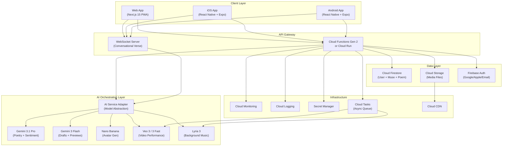
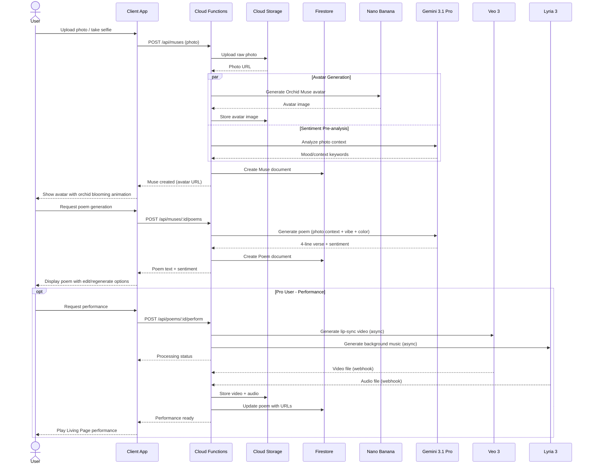
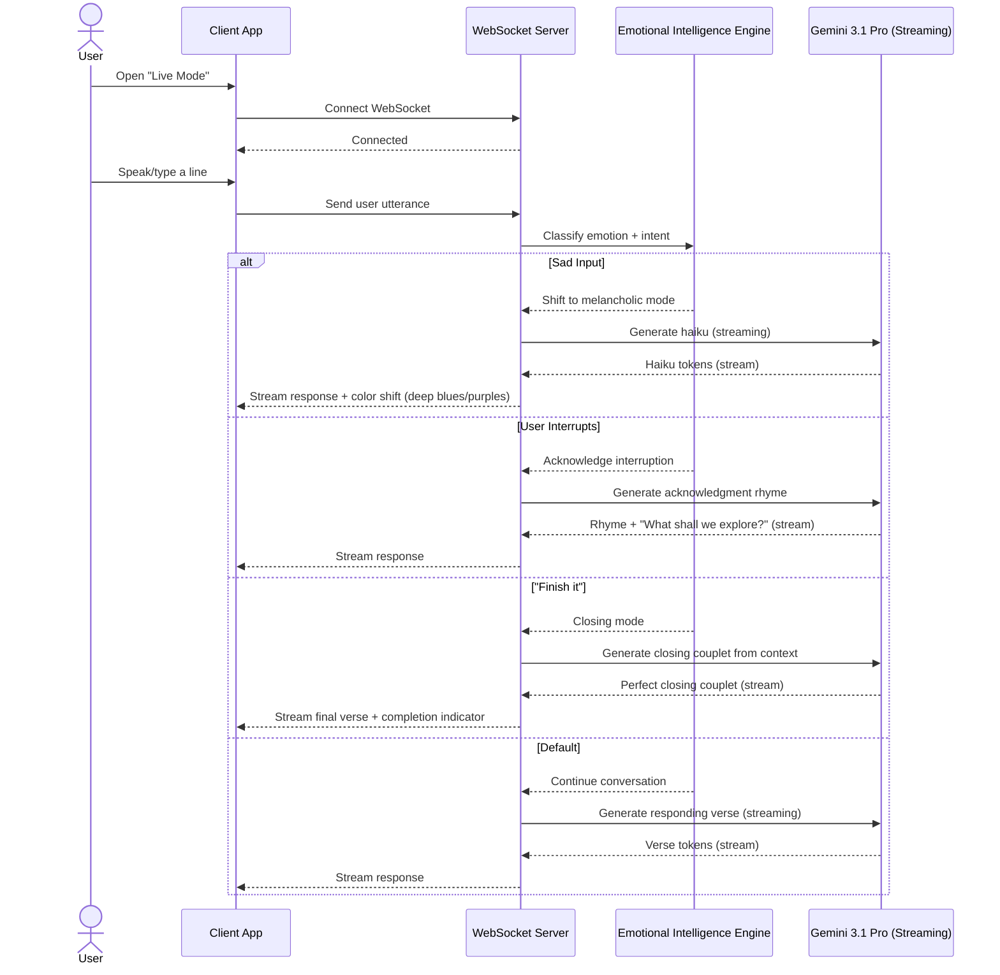

# 🏗️ The Living Muse — System Architecture

**Version:** 1.0
**Date:** March 8, 2026

---

## 1. Architecture Overview



---

## 2. AI Service Adapter Pattern

The **AI Service Adapter** is the most critical architectural decision. It abstracts all AI model calls behind a unified interface so that:
- Models can be **swapped without code changes** (e.g., Veo 3 → Veo 4)
- **Fallback chains** can be defined (Gemini Pro → Flash on timeout)
- **Cost tracking** is centralized per-call
- **Prompt templates** are versioned and cached

```
┌─────────────────────────────────────────────────────┐
│                AI Service Adapter                    │
│                                                      │
│  ┌──────────────────────────────────────────────┐   │
│  │             Model Registry                    │   │
│  │  ┌─────────┐ ┌─────────┐ ┌────────────────┐  │   │
│  │  │ gemini- │ │ nano-   │ │ veo-3         │  │   │
│  │  │ 3.1-pro │ │ banana  │ │               │  │   │
│  │  └─────────┘ └─────────┘ └────────────────┘  │   │
│  └──────────────────────────────────────────────┘   │
│                                                      │
│  ┌──────────────────────────────────────────────┐   │
│  │          Prompt Template Engine               │   │
│  │  • Versioned prompt templates                 │   │
│  │  • Variable injection (vibe, color, mood)     │   │
│  │  • Style persistence (favorite color auto)    │   │
│  └──────────────────────────────────────────────┘   │
│                                                      │
│  ┌──────────────────────────────────────────────┐   │
│  │          Cost Tracker                         │   │
│  │  • Per-request cost logging                   │   │
│  │  • User quota enforcement                     │   │
│  │  • Monthly budget alerts                      │   │
│  └──────────────────────────────────────────────┘   │
└─────────────────────────────────────────────────────┘
```

---

## 3. Request Flow — Creating a Living Page

### 3.1 Sequence Diagram



### 3.2 Latency Budget

| Step | Target | Model | Parallel? |
|------|--------|-------|-----------|
| Photo upload | 2s | Cloud Storage | — |
| Avatar generation | 5s | Nano Banana | ✅ with sentiment |
| Sentiment pre-analysis | 2s | Gemini Flash | ✅ with avatar |
| Poem generation | 3s | Gemini 3.1 Pro | — |
| **Total (photo → poem)** | **< 10s** | | |
| Video generation | 30–45s | Veo 3 | ✅ with music |
| Music generation | 10–15s | Lyria 3 | ✅ with video |
| **Total (performance)** | **< 60s** | | (async, user notified) |

---

## 4. Conversational Verse Architecture



---

## 5. Deployment Architecture

### 5.1 Environments

| Environment | Purpose | URL |
|-------------|---------|-----|
| **Development** | Local + Firebase Emulator | `localhost:3000` |
| **Staging** | Pre-release testing | `staging.thelivingmuse.app` |
| **Production** | Live users | `thelivingmuse.app` |

### 5.2 CI/CD Pipeline

```
┌──────────┐    ┌──────────┐    ┌──────────┐    ┌──────────┐
│  Push to │───▶│  GitHub   │───▶│  Build + │───▶│  Deploy  │
│  main    │    │  Actions  │    │  Test    │    │  (Auto)  │
└──────────┘    └──────────┘    └──────────┘    └──────────┘
                                     │
                              ┌──────┴──────┐
                              │   Lint      │
                              │   Type Check│
                              │   Unit Test │
                              │   E2E Test  │
                              └─────────────┘
```

### 5.3 Scaling Strategy

| Component | Scaling Method | Trigger |
|-----------|---------------|---------|
| Cloud Functions | Auto-scale (0 → N) | Request count |
| Cloud Run | Auto-scale (min 1) | CPU/memory utilization |
| Firestore | Auto (managed) | Read/write operations |
| Cloud Storage | Auto (managed) | Storage volume |
| WebSocket Server | Cloud Run (min instances) | Connection count |

---

## 6. Cost Control Architecture

```
┌─────────────────────────────────────────────────┐
│              Cost Control Layer                  │
│                                                  │
│  ┌────────────────────┐  ┌───────────────────┐  │
│  │  Usage Quota        │  │  Budget Alerts    │  │
│  │  Enforcer           │  │  (50/80/100%)     │  │
│  │  • 3/mo free tier   │  │                   │  │
│  │  • 15/mo pro tier   │  │                   │  │
│  └────────────────────┘  └───────────────────┘  │
│                                                  │
│  ┌────────────────────┐  ┌───────────────────┐  │
│  │  Model Router       │  │  Cost Logger      │  │
│  │  • Flash for drafts │  │  • Per-request    │  │
│  │  • Pro for finals   │  │  • Per-user/mo    │  │
│  │  • Batch for async  │  │  • Dashboard      │  │
│  └────────────────────┘  └───────────────────┘  │
└─────────────────────────────────────────────────┘
```
