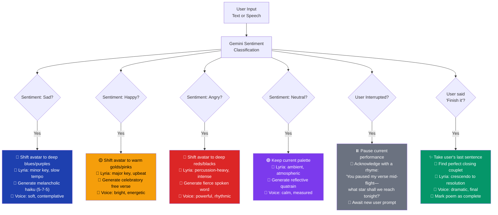
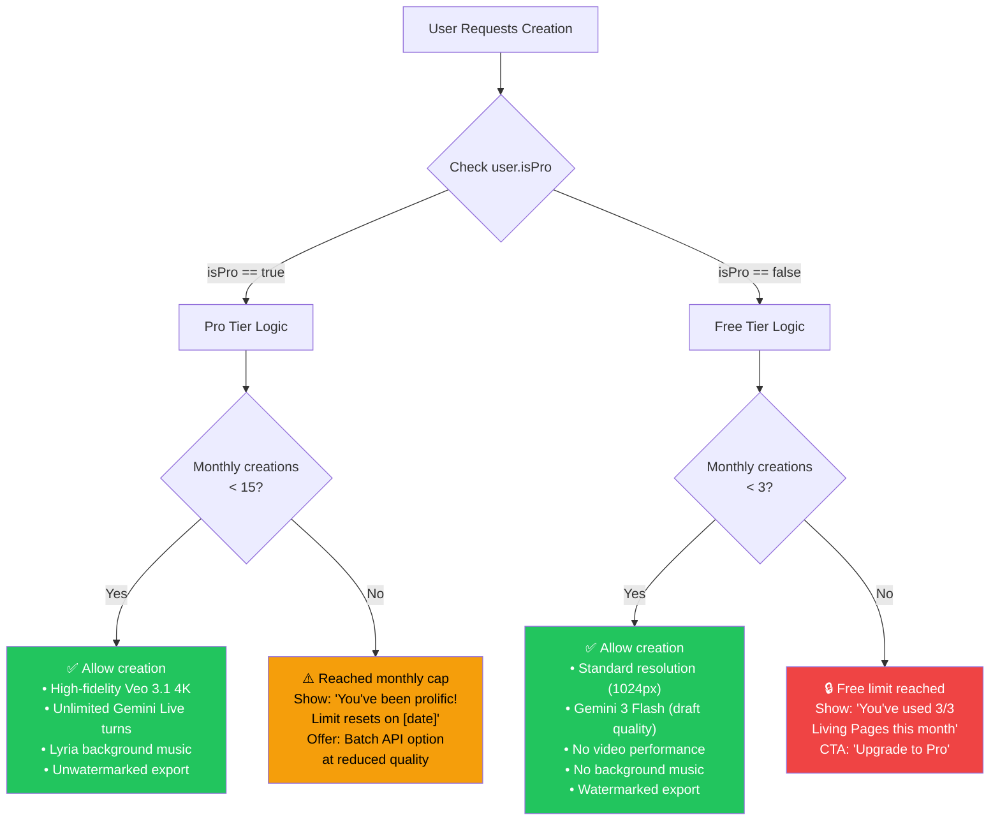
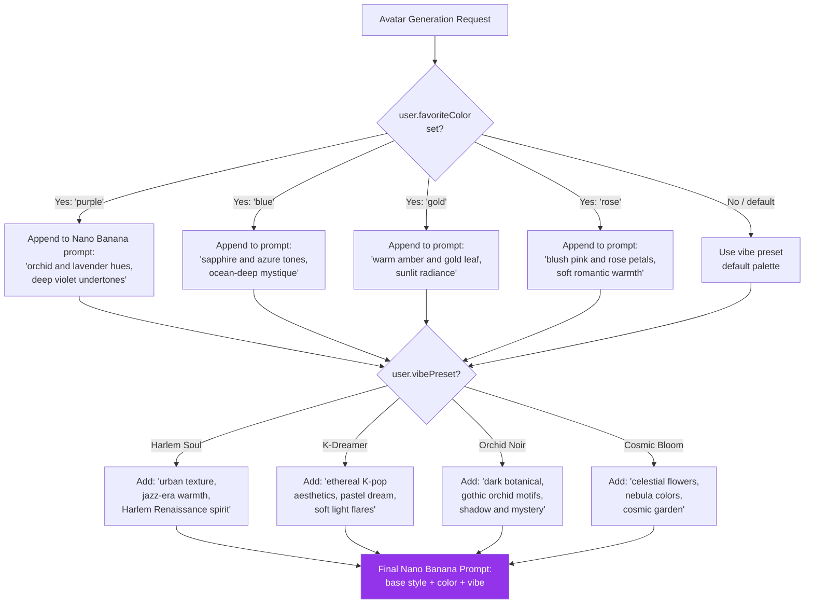
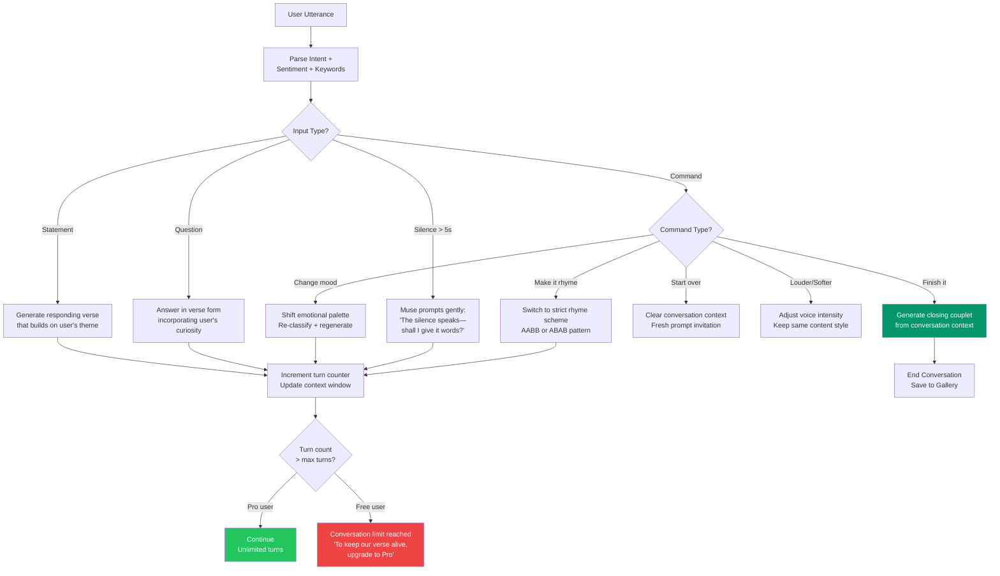
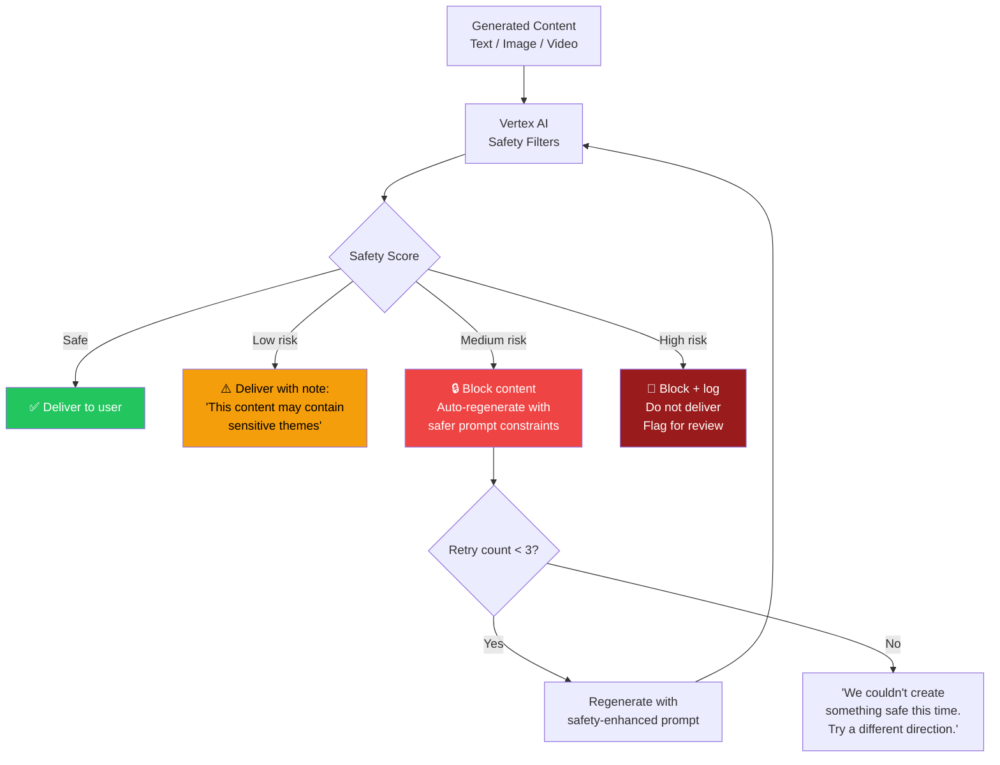

# 🌳 The Living Muse — Conditional Logic Trees

**Version:** 1.0
**Date:** March 8, 2026

---

## 1. Emotional Intelligence Engine — Core Decision Tree

The Muse doesn't generate poetry randomly. It follows a structured emotional logic system that analyzes user input and adapts the visual, textual, and auditory output in real-time.

---

## 2. Pro Tier Quota Logic

---

## 3. Style Persistence Logic

---

## 4. Conversational Verse — Response Selection Logic

---

## 5. Content Safety — Moderation Logic

---

## 6. Logic Reference Table

| Logic ID | Name | Condition | Action |
|----------|------|-----------|--------|
| L-A | Pro Quota Check | `user.isPro == true` | Allow Veo 3.1 4K + unlimited Gemini Live turns |
| L-B | Style Persistence | `user.favoriteColor == 'purple'` | Append "orchid and lavender hues" to all image prompts |
| L-C | Sad Sentiment | Sentiment classifier → negative | Shift blues/purples, haiku, minor key music |
| L-D | Interruption Handler | User speech during Muse performance | Pause, rhyme acknowledgment, await new prompt |
| L-E | Close Command | User says "finish it" | Generate closing couplet from context |
| L-F | Free Limit | `user.monthlyCreations >= 3 && !user.isPro` | Block creation, show upgrade prompt |
| L-G | Content Safety | Vertex AI safety score > threshold | Block, auto-regenerate, or flag for review |
| L-H | Vibe Injection | `user.vibePreset` set | Add vibe-specific style tokens to all prompts |
| L-I | Silence Detection | No user input > 5 seconds | Muse prompts gently in verse |
| L-J | Mood Change | User requests mood change | Re-classify sentiment, regenerate with new palette |
