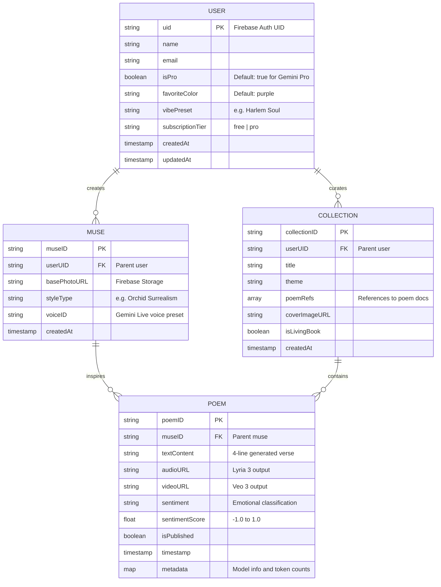

# 🗃️ The Living Muse — Entity Relationship Diagram (ERD)

**Version:** 1.0
**Date:** March 8, 2026
**Database:** Cloud Firestore (NoSQL / Document-oriented)

---

## 1. Visual ERD



---

## 2. Firestore Document Hierarchy

```
Cloud Firestore
│
├── users (Collection)
│   └── {uid} (Document)
│       ├── name: "Jessenia Cintron"
│       ├── email: "jessenia@example.com"
│       ├── isPro: true
│       ├── favoriteColor: "purple"
│       ├── vibePreset: "Harlem Soul"
│       ├── subscriptionTier: "pro"
│       ├── createdAt: 2026-03-08T12:00:00Z
│       ├── updatedAt: 2026-03-08T14:00:00Z
│       │
│       ├── muses (Sub-collection)
│       │   └── {museID} (Document)
│       │       ├── museID: "muse_001"
│       │       ├── basePhotoURL: "gs://living-muse/photos/uid/selfie.jpg"
│       │       ├── styleType: "Orchid Surrealism"
│       │       ├── voiceID: "aoede"
│       │       ├── createdAt: 2026-03-08T12:05:00Z
│       │       │
│       │       └── poems (Sub-collection)
│       │           └── {poemID} (Document)
│       │               ├── poemID: "poem_001"
│       │               ├── textContent: "Petals fall like whispered dreams..."
│       │               ├── audioURL: "gs://living-muse/audio/uid/poem_001.mp3"
│       │               ├── videoURL: "gs://living-muse/video/uid/poem_001.mp4"
│       │               ├── sentiment: "melancholic"
│       │               ├── sentimentScore: -0.4
│       │               ├── isPublished: true
│       │               ├── timestamp: 2026-03-08T12:06:00Z
│       │               └── metadata:
│       │                   ├── generationModel: "gemini-3.1-pro"
│       │                   ├── promptTokens: 850
│       │                   └── outputTokens: 420
│       │
│       └── collections (Sub-collection)
│           └── {collectionID} (Document)
│               ├── title: "Midnight Orchids"
│               ├── theme: "nocturnal beauty"
│               ├── poemRefs: [ref(/users/uid/muses/m1/poems/p1), ...]
│               ├── coverImageURL: "gs://living-muse/covers/uid/col_001.png"
│               ├── isLivingBook: false
│               └── createdAt: 2026-03-08T13:00:00Z
```

---

## 3. Data Flow Diagram

```
┌──────────┐     ┌────────────┐     ┌──────────────┐
│   USER   │────▶│   Upload   │────▶│ Cloud Storage │
│ (Client) │     │   Photo    │     │ (Raw Photo)   │
└──────────┘     └─────┬──────┘     └──────────────┘
                       │
                       ▼
              ┌────────────────┐
              │  Nano Banana   │──────▶ Cloud Storage
              │  Avatar Gen    │        (Avatar Image)
              └───────┬────────┘
                      │
                      ▼
              ┌────────────────┐
              │  Gemini 3.1    │──────▶ Firestore
              │  Poem Gen +    │        (Poem Document)
              │  Sentiment     │
              └───────┬────────┘
                      │
          ┌───────────┴───────────┐
          ▼                       ▼
  ┌──────────────┐      ┌──────────────┐
  │   Veo 3      │      │   Lyria 3    │
  │  Video Gen   │      │  Music Gen   │
  └──────┬───────┘      └──────┬───────┘
         │                     │
         ▼                     ▼
  Cloud Storage          Cloud Storage
  (Video File)           (Audio File)
         │                     │
         └──────────┬──────────┘
                    ▼
            ┌──────────────┐
            │   Firestore  │
            │  Update Poem │
            │  (URLs)      │
            └──────────────┘
```

---

## 4. Relationships Summary

| Relationship | Type | Description |
|-------------|------|-------------|
| User → Muse | One-to-Many | A user can create multiple Orchid Muse avatars |
| User → Collection | One-to-Many | A user can curate multiple poetry collections |
| Muse → Poem | One-to-Many | Each muse can inspire multiple poems |
| Collection → Poem | Many-to-Many | A collection references poems from any of the user's muses |
| Poem → Media | One-to-One | Each poem has at most one video and one audio file |

---

## 5. Storage Bucket Structure

```
gs://living-muse-media/
├── photos/
│   └── {uid}/
│       └── {museID}_original.{ext}     # Raw uploaded photo
├── avatars/
│   └── {uid}/
│       └── {museID}_avatar.png          # Nano Banana output
├── audio/
│   └── {uid}/
│       └── {poemID}_lyria.mp3           # Lyria 3 output
├── video/
│   └── {uid}/
│       └── {poemID}_performance.mp4     # Veo 3 output
├── covers/
│   └── {uid}/
│       └── {collectionID}_cover.png     # Collection cover image
└── exports/
    └── {uid}/
        └── {exportID}_final.mp4         # Composed final export
```
