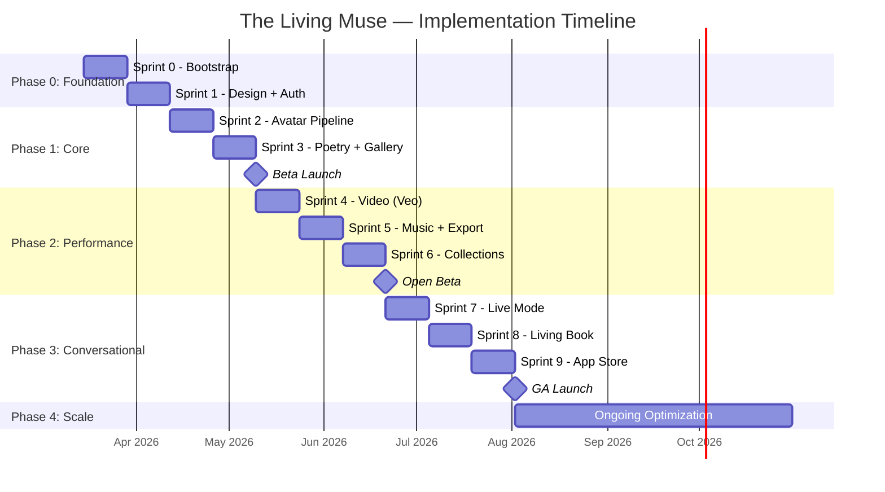

# 🗺️ The Living Muse — Sequential Implementation Roadmap

**Version:** 1.0
**Date:** March 8, 2026
**Methodology:** Agile Scrum — 2-week sprints
**Optimization Principle:** Every phase is designed to be the smallest viable unit that delivers user value or de-risks the next phase.

---

## Roadmap Philosophy

> **McKinsey 7S alignment:** Each phase builds one layer of the 7S model — Systems first, then Structure, then Strategy execution. No phase depends on a future phase's output.

> **5 Whys applied to sequencing:** Why this order? → Because each phase validates the riskiest assumption before investing in the next layer.

---

## Phase 0: Foundation 🏗️
**Duration:** 2 sprints (4 weeks)
**Risk being validated:** "Can we stand up the infrastructure and development environment?"

### Sprint 0 — Project Bootstrap
| # | Task | Owner | Status |
|---|------|-------|--------|
| 0.1 | Initialize monorepo structure (`apps/web`, `apps/mobile`, `packages/shared`, `firebase/`) | Dev | ☐ |
| 0.2 | Set up Next.js 15 web app with App Router | Dev | ☐ |
| 0.3 | Set up React Native + Expo mobile app | Dev | ☐ |
| 0.4 | Create GCP project + enable Vertex AI APIs | Jessenia | ☐ |
| 0.5 | Apply for Google Startup Credits ($200K–$350K) | Jessenia | ☐ |
| 0.6 | Set up Firebase project (Auth, Firestore, Storage) | Dev | ☐ |
| 0.7 | Deploy Firestore security rules + indexes | Dev | ☐ |
| 0.8 | Set up GitHub Actions CI/CD pipeline | Dev | ☐ |
| 0.9 | Configure Secret Manager for API keys | Dev | ☐ |
| 0.10 | Set up Cloud Monitoring + budget alerts | Dev | ☐ |

### Sprint 1 — Design System + Auth
| # | Task | Owner | Status |
|---|------|-------|--------|
| 1.1 | Design system: colors (orchid purple, gold, deep blue), typography, spacing | Carolina | ☐ |
| 1.2 | Component library: buttons, cards, inputs, modals | Dev | ☐ |
| 1.3 | Firebase Auth integration (Google, Apple, Email) | Dev | ☐ |
| 1.4 | User profile creation on first sign-in | Dev | ☐ |
| 1.5 | Onboarding flow: vibe selection + favorite color | Dev | ☐ |
| 1.6 | Basic navigation: Home, Gallery, Settings | Dev | ☐ |
| 1.7 | Splash screen with orchid animation | Carolina | ☐ |

**Phase 0 Exit Criteria:**
- [ ] User can sign up, select vibe/color, and land on empty Gallery
- [ ] CI/CD deploys to staging automatically
- [ ] Budget alerts are active

---

## Phase 1: Core Experience 🎨
**Duration:** 2 sprints (4 weeks)
**Risk being validated:** "Can we deliver the photo → avatar → poem flow in under 10 seconds with acceptable quality?"

### Sprint 2 — Avatar Generation Pipeline
| # | Task | Owner | Status |
|---|------|-------|--------|
| 2.1 | Photo upload component (camera + gallery) | Dev | ☐ |
| 2.2 | Cloud Storage upload with signed URL | Dev | ☐ |
| 2.3 | AI Service Adapter — base architecture | Dev | ☐ |
| 2.4 | Nano Banana integration — avatar generation | Dev | ☐ |
| 2.5 | Style persistence logic (favorite color → prompt injection) | Dev | ☐ |
| 2.6 | Vibe preset → prompt template mapping | Dev | ☐ |
| 2.7 | "Orchid Blooming" loading animation | Carolina | ☐ |
| 2.8 | Avatar display component | Dev | ☐ |
| 2.9 | Muse document creation in Firestore | Dev | ☐ |

### Sprint 3 — Poetry Generation + Gallery
| # | Task | Owner | Status |
|---|------|-------|--------|
| 3.1 | Gemini 3.1 Pro integration — poem generation | Dev | ☐ |
| 3.2 | Gemini 3 Flash integration — cost-optimized drafts | Dev | ☐ |
| 3.3 | Sentiment analysis pipeline | Dev | ☐ |
| 3.4 | Poem display component (typography, animation) | Dev | ☐ |
| 3.5 | Edit poem inline | Dev | ☐ |
| 3.6 | Regenerate poem button | Dev | ☐ |
| 3.7 | Save Living Page to Gallery (Firestore CRUD) | Dev | ☐ |
| 3.8 | Gallery grid view with Living Page cards | Dev | ☐ |
| 3.9 | Living Page detail view | Dev | ☐ |
| 3.10 | Credit system implementation (deduct/refund/grant) | Dev | ☐ |
| 3.11 | Cost tracking per request in Firestore | Dev | ☐ |
| 3.12 | Separated creation flows (poem, avatar, audio, video pages) | Dev | ☐ |

**Phase 1 Exit Criteria:**
- [ ] User can upload photo → see avatar → get poem → save to Gallery in < 10s
- [ ] Free tier limit (15 credits/month) is enforced via credit.service.ts
- [ ] Cost per free creation < $0.05
- [ ] **Beta-ready: invite 500 users**

---

## Phase 2: Performance & Monetization 🎬
**Duration:** 3 sprints (6 weeks)
**Risk being validated:** "Will users pay for a 4-tier credit system? Can we keep margins above 52% in worst case?"

### Sprint 4 — Video Performance (Veo 3)
| # | Task | Owner | Status |
|---|------|-------|--------|
| 4.1 | Veo 3 integration — video generation | Dev | ☐ |
| 4.2 | Async job queue (Cloud Tasks) for video processing | Dev | ☐ |
| 4.3 | Video player component | Dev | ☐ |
| 4.4 | Video generation status UI (processing → ready) | Dev | ☐ |
| 4.5 | Cloud Storage video upload with CDN delivery | Dev | ☐ |

### Sprint 5 — Music + Export + Pro Tier
| # | Task | Owner | Status |
|---|------|-------|--------|
| 5.1 | Lyria 3 integration — background music generation | Dev | ☐ |
| 5.2 | Audio player component | Dev | ☐ |
| 5.3 | Video + audio composition (final Living Page playback) | Dev | ☐ |
| 5.4 | Social export — SD watermarked (free) | Dev | ☐ |
| 5.5 | Social export — 4K unwatermarked (Pro) | Dev | ☐ |
| 5.6 | Share to TikTok / Instagram / Save to Camera Roll | Dev | ☐ |
| 5.7 | 4-tier subscription implementation (Stripe + IAP) — Free/Starter/Pro/Studio | Dev | ☐ |
| 5.8 | Pricing page with credit system, annual toggle, credit packs | Carolina | ☐ |
| 5.9 | Subscription management (cancel, downgrade) | Dev | ☐ |

### Sprint 6 — Collections + Polish
| # | Task | Owner | Status |
|---|------|-------|--------|
| 6.1 | Collections CRUD (create, add poems, reorder) | Dev | ☐ |
| 6.2 | Collection cover image generation | Dev | ☐ |
| 6.3 | Gallery sorting/filtering | Dev | ☐ |
| 6.4 | Settings page (profile, subscription, vibe, color) | Dev | ☐ |
| 6.5 | Push notifications (new style packs, streak reminders) | Dev | ☐ |
| 6.6 | Performance optimization (caching, lazy loading) | Dev | ☐ |
| 6.7 | Accessibility audit (WCAG 2.1 AA) | Dev | ☐ |
| 6.8 | Analytics integration (Firebase Analytics) | Dev | ☐ |

**Phase 2 Exit Criteria:**
- [ ] Pro users can generate video performances + music
- [ ] Export works for TikTok/Instagram
- [ ] Stripe/IAP payments functional
- [ ] Pro creation cost < $2.00; margins ≥52% worst-case
- [ ] Credit packs purchasable (one-time, never expire)
- [ ] **Open beta launch**

---

## Phase 3: Conversational Verse & Publishing 💬
**Duration:** 3 sprints (6 weeks)
**Risk being validated:** "Does real-time conversational poetry retain users better than static generation?"

### Sprint 7 — Conversational Verse (Live Mode)
| # | Task | Owner | Status |
|---|------|-------|--------|
| 7.1 | WebSocket server (Cloud Run) | Dev | ☐ |
| 7.2 | Gemini 3.1 Pro streaming integration | Dev | ☐ |
| 7.3 | Emotional Intelligence Engine — sentiment classification | Dev | ☐ |
| 7.4 | Conditional logic implementation (sad, interrupt, finish) | Dev | ☐ |
| 7.5 | Real-time avatar color shifting based on sentiment | Dev | ☐ |
| 7.6 | Conversational UI (chat-like interface with verse bubbles) | Carolina | ☐ |
| 7.7 | Speech-to-text input (Web Speech API / Expo) | Dev | ☐ |
| 7.8 | Text-to-speech for Muse responses | Dev | ☐ |

### Sprint 8 — Living Book + Content Safety
| # | Task | Owner | Status |
|---|------|-------|--------|
| 8.1 | Living Book editor — select 10 poems, order, theme | Dev | ☐ |
| 8.2 | Living Book cover generation (Nano Banana) | Dev | ☐ |
| 8.3 | Living Book export (premium PDF/digital file) | Dev | ☐ |
| 8.4 | One-time purchase flow ($14.99) | Dev | ☐ |
| 8.5 | Content safety — Vertex AI filters integration | Dev | ☐ |
| 8.6 | Custom blocklist for offensive content | Dev | ☐ |
| 8.7 | Moderation dashboard (admin) | Dev | ☐ |

### Sprint 9 — App Store Launch + Marketing
| # | Task | Owner | Status |
|---|------|-------|--------|
| 9.1 | iOS app build + App Store submission | Dev | ☐ |
| 9.2 | Android app build + Play Store submission | Dev | ☐ |
| 9.3 | App Store Optimization (screenshots, description, keywords) | Carolina | ☐ |
| 9.4 | Landing page (thelivingmuse.app) | Carolina | ☐ |
| 9.5 | SEO content (blog posts, "how it works") | Carolina | ☐ |
| 9.6 | Influencer outreach (10 poetry creators) | Jessenia | ☐ |
| 9.7 | TikTok content strategy launch | Carolina | ☐ |
| 9.8 | PR / press release | Jessenia | ☐ |

**Phase 3 Exit Criteria:**
- [ ] Conversational Verse works in real-time
- [ ] Living Book purchase flow functional
- [ ] iOS and Android apps approved in stores
- [ ] Content safety filters active
- [ ] **General Availability launch**

---

## Phase 4: Scale & Optimize 📈
**Duration:** Ongoing
**Focus:** Revenue growth, cost optimization, feature expansion

### Priorities
| # | Task | Owner | Status |
|---|------|-------|--------|
| 4.1 | A/B test pricing ($7.99 vs $9.99 vs $12.99) | Jessenia | ☐ |
| 4.2 | Reduce Veo costs — evaluate Veo 3 Fast default | Dev | ☐ |
| 4.3 | Batch API for non-real-time avatar generation (50% savings) | Dev | ☐ |
| 4.4 | Community features — public Gallery, likes, comments | Dev | ☐ |
| 4.5 | New vibe packs (quarterly releases) | Carolina | ☐ |
| 4.6 | B2B licensing for educators | Jessenia | ☐ |
| 4.7 | API/SDK for third-party integrations | Dev | ☐ |
| 4.8 | Multi-language support (Spanish, Korean, French) | Dev | ☐ |
| 4.9 | AR Living Pages (pilot) | Dev | ☐ |
| 4.10 | Partnership integrations (Spotify, Button Poetry) | Jessenia | ☐ |

---

## Timeline Summary

```
Month 1-2:   Phase 0 — Foundation (Sprint 0-1)
Month 2-3:   Phase 1 — Core Experience (Sprint 2-3) ← BETA LAUNCH
Month 4-6:   Phase 2 — Performance & Monetization (Sprint 4-6) ← OPEN BETA
Month 7-9:   Phase 3 — Conversational & Publishing (Sprint 7-9) ← GA LAUNCH
Month 10+:   Phase 4 — Scale & Optimize ← GROWTH
```



---

## Critical Path

The following items are on the critical path — delays here delay everything:

1. **GCP Project Setup + Startup Credits Application** (Sprint 0) — blocks all AI work
2. **AI Service Adapter** (Sprint 2) — blocks all model integrations
3. **Nano Banana Avatar Generation** (Sprint 2) — blocks the core experience
4. **Gemini Poetry Generation** (Sprint 3) — blocks the core experience
5. **Veo 3 Video Generation** (Sprint 4) — blocks Pro tier value proposition
6. **Stripe/IAP Payment Integration** (Sprint 5) — blocks revenue

---

## Decision Log

| Date | Decision | Rationale | Alternatives Considered |
|------|----------|-----------|------------------------|
| 2026-03-08 | Web-first, then native mobile | Faster iteration; PWA covers mobile browsers | Native-first (slower, more expensive) |
| 2026-03-08 | Google-only AI stack | Single vendor = credits, support, billing simplicity | Multi-vendor (complex, no credits) |
| 2026-03-08 | 4-tier credit-based pricing | Weighted credits prevent margin erosion; $9.99 Starter captures casual creators | 2-tier (Free/Pro) — negative margins on video |
| 2026-03-08 | Separated creation flows | Independent poem/avatar/audio/video pages enable credit-priced operations | Bundled pipeline — can't price per operation |
| 2026-03-08 | Pink-purple color palette | Color psychology: purple=luxury/creativity, pink=warmth/trust; WCAG AA compliant | Orchid-only (too narrow), blue (too corporate) |
| 2026-03-08 | Loveable integration (selective) | Adopted credit system, UI patterns, and cost protection; skipped Vite/Tailwind/shadcn | Full merge (incompatible tech stacks) |
| 2026-03-08 | Gemini 3 Flash for free tier | 85% cost reduction vs Pro | Pro for everyone (too expensive) |
| 2026-03-08 | React Native + Expo for mobile | Cross-platform from shared codebase | SwiftUI + Kotlin (2× dev effort) |
| 2026-03-08 | Firestore over SQL | Real-time sync, offline support, Firebase integration | PostgreSQL (more powerful, less integrated) |
