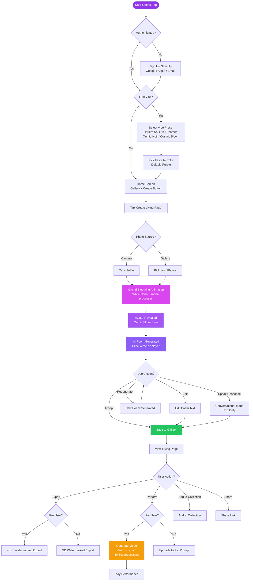
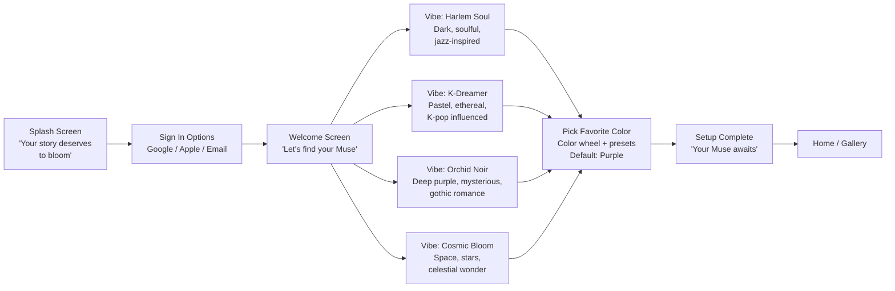
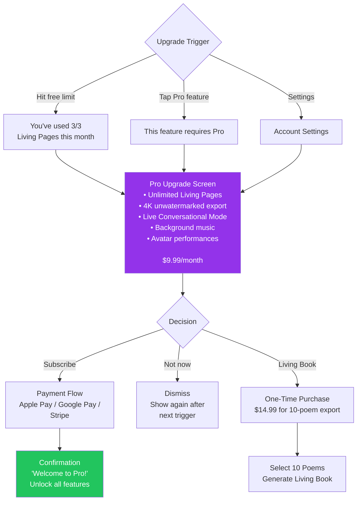
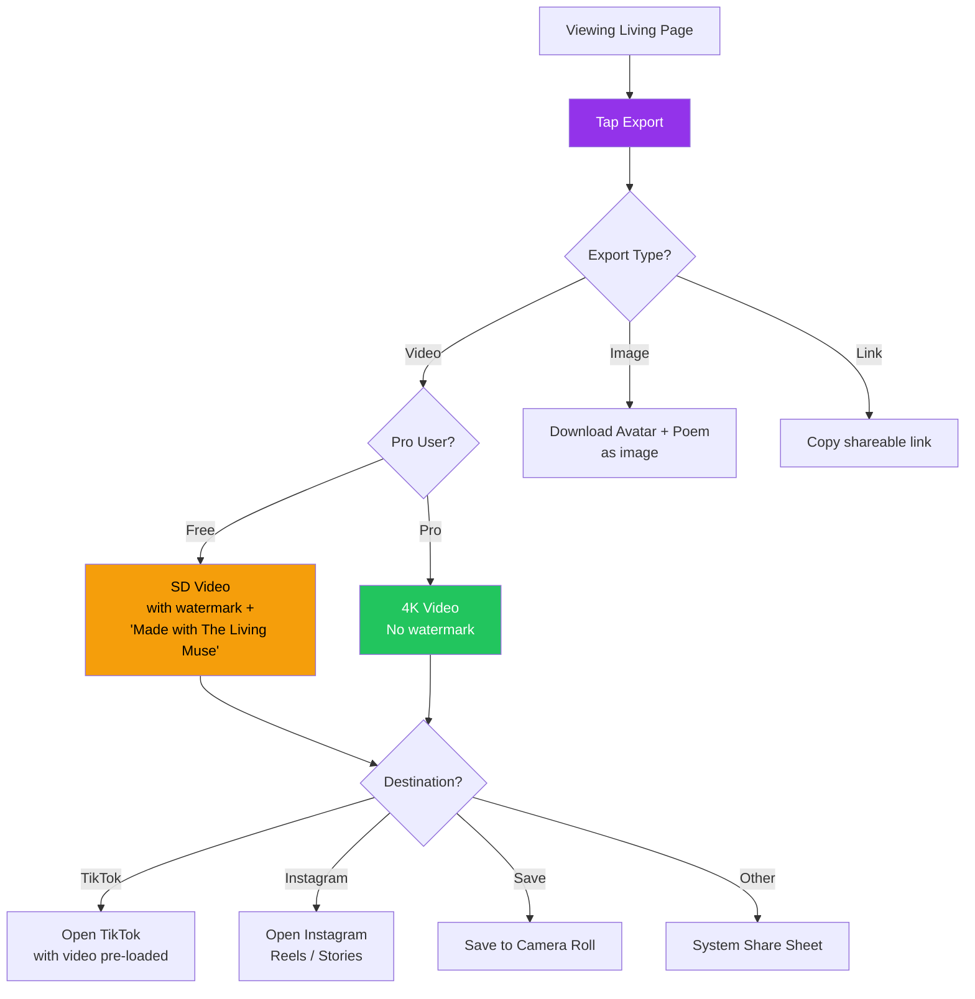

# 🚶 The Living Muse — User Flows & Journey Maps

**Version:** 1.0
**Date:** March 8, 2026

---

## 1. Primary User Flow — Creating a Living Page

---

## 2. Onboarding Flow

---

## 3. User Journey Map — "Maya" (Aspiring Poet)

| Stage | Awareness | Consideration | Onboarding | First Use | Habit | Advocacy |
|-------|-----------|---------------|------------|-----------|-------|----------|
| **Action** | Sees TikTok of Living Page | Downloads app | Selects "Harlem Soul" vibe | Creates first Living Page | Creates 3+ pages/week | Shares on Instagram |
| **Touchpoint** | TikTok Reel | App Store | Onboarding flow | Create flow | Gallery + notifications | Social export |
| **Emotion** | 😮 "Wow, what is this?" | 🤔 "Can I make this?" | 😊 "This feels like me" | 🤩 "My poem came to life!" | 💜 "I can't stop creating" | 🎉 "Everyone needs to see this" |
| **Pain Point** | — | "Is this free?" | "Too many steps?" | "Will the poem be good?" | "I'm out of free pages" | "Watermark is annoying" |
| **Opportunity** | Viral hook | Clear free tier | 4-step onboarding | Quality AI output | Pro upsell | Remove watermark = Pro |

---

## 4. User Journey Map — "Kai" (Social Creative)

| Stage | Awareness | Consideration | First Use | Conversion | Retention |
|-------|-----------|---------------|-----------|------------|-----------|
| **Action** | Influencer post with Muse tag | Visits landing page | Creates Living Page | Upgrades to Pro for 4K | Daily creator |
| **Touchpoint** | Instagram | Website | App | In-app purchase | Push + email |
| **Emotion** | 😍 "This is so aesthetic" | 🤔 "Better than Prisma?" | 🎨 "Way more unique" | 💰 "Worth it for 4K" | 🔄 "Part of my workflow" |
| **Key Metric** | Impression → click rate | Visit → download rate | Download → first create | Free → Pro conversion | D7 / D30 retention |
| **Target** | 5% click rate | 30% download rate | 60% activation | 5% conversion | 40% D7, 25% D30 |

---

## 5. Pro Upgrade Flow

---

## 6. Export & Share Flow

---

## 7. Screen Inventory

| # | Screen | Route | Auth Required | Notes |
|---|--------|-------|---------------|-------|
| 1 | Splash | `/` | No | Animated orchid + tagline |
| 2 | Sign In | `/auth` | No | Google / Apple / Email |
| 3 | Onboarding — Vibe | `/onboard/vibe` | Yes | First-time only |
| 4 | Onboarding — Color | `/onboard/color` | Yes | First-time only |
| 5 | Home / Gallery | `/gallery` | Yes | Grid of Living Pages |
| 6 | Create — Photo | `/create/photo` | Yes | Camera or upload |
| 7 | Create — Processing | `/create/processing` | Yes | Orchid bloom animation |
| 8 | Create — Result | `/create/result` | Yes | Avatar + poem display |
| 9 | Living Page View | `/page/:id` | Yes | Full multimedia view |
| 10 | Performance Player | `/page/:id/play` | Yes (Pro) | Video + music playback |
| 11 | Conversational Verse | `/page/:id/converse` | Yes (Pro) | Real-time chat mode |
| 12 | Collections | `/collections` | Yes | List of collections |
| 13 | Collection Detail | `/collections/:id` | Yes | Poems in collection |
| 14 | Living Book Editor | `/book/:id` | Yes | 10-poem layout editor |
| 15 | Settings | `/settings` | Yes | Profile, subscription, vibe |
| 16 | Pro Upgrade | `/upgrade` | Yes | Subscription prompt |
| 17 | Export | `/export/:id` | Yes | Export options |
